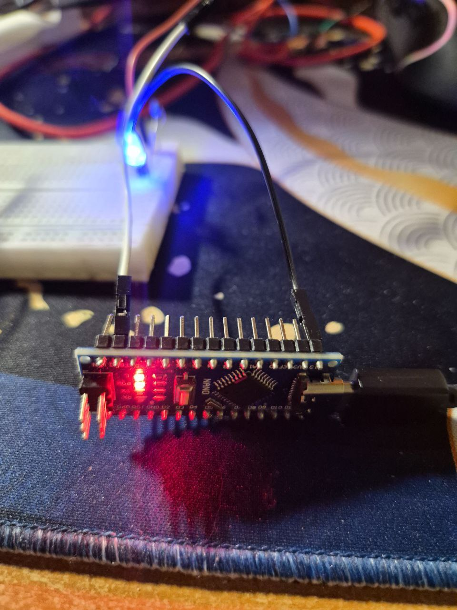
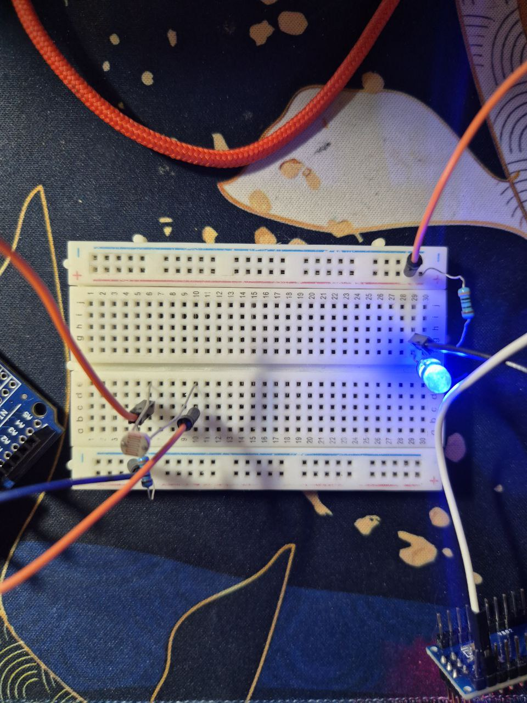
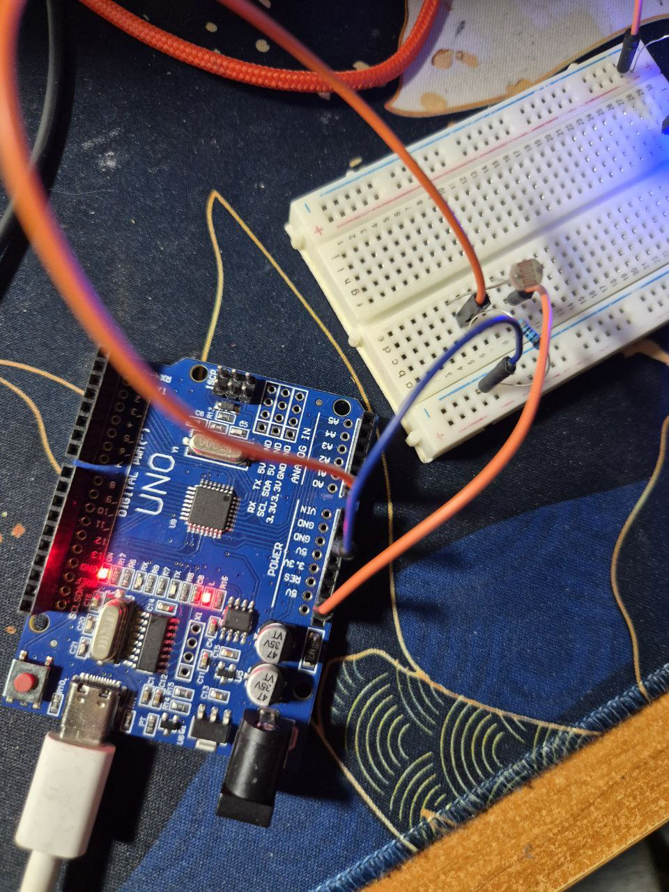

### Задача: 
Необходимо построить распределённую IoT-систему, в которой два микроконтроллера обмениваются данными с отдельными ПК по UART/Serial, а ПК взаимодействуют между собой через MQTT.
### Требования:
    Микроконтроллер-датчик постоянно считывает данные с фоторезистора
    ПК1 публикует показания датчика в MQTT
    ПК2 получает данные освещённости и управляет светодиодом в зависимости от порогового значения
    Все служебные сообщения публикуются в соответствующие топики
    Монитор отображает все сообщения и проверяет корректность работы системы — соответствуют ли действия компонентов ожидаемому поведению




Tinkercad: https://www.tinkercad.com/things/ciP8csl3qoc/editel?returnTo=%2Fdashboard%2Fdesigns%2Fcircuits&sharecode=3uYKiwL4hM-Z3kJfwz9tleh7-qk7NU1_CqSklxB0p4M
### Рассмотрим код и логику его работы.

Система построена на архитектуре "Издатель-Подписчик" (Pub/Sub) с использованием протокола MQTT, связь осуществляется через последовательные порты.

##### 1. Прошивка сенсорного узла (LightNode.ino)
Микроконтроллер работает как "Slave"-устройство, отвечая на запросы ведущего.

```cpp
#define BAUD_RATE 9600
const char CMD_GET_DATA = 'p';

void processIncomingCommand() {
  if (Serial.available() > 0) {
    char incomingByte = Serial.read();
    
    switch (incomingByte) {
      case CMD_GET_DATA:
        int rawValue = analogRead(SENSOR_PIN);
        Serial.print("DATA:");
        Serial.println(rawValue);
        break;
        
      case CMD_STREAM_START:
        isStreaming = true;
        break;
    }
  }
}
```
- реализует командный интерфейс поверх UART: 'p' (poll) для одиночного запроса, 's' (stream) для потока
- форматирует выходные данные с префиксом `DATA:` для упрощения парсинга на стороне ПК
- обработка команд вынесена в отдельную функцию для разгрузки `loop()`

##### 2. Прошивка исполнительного узла (LedNode.ino)

```cpp
void setLedState(bool state) {
  if (state) {
    digitalWrite(LED_PIN, HIGH);
    Serial.println("ACK:LED_ON");
  } else {
    digitalWrite(LED_PIN, LOW);
    Serial.println("ACK:LED_OFF");
  }
}

void loop() {
  if (Serial.available() > 0) {
    char cmd = Serial.read();
    if (cmd == 'u') setLedState(true);
    else if (cmd == 'd') setLedState(false);
  }
}
```
- реализует реакцию на управляющие байты 'u' и 'd' 
- отправляет подтверждение (ACKnowledgement) после физического переключения пина
- статус в MQTT-брокере обновится только после реального срабатывания устройства

##### 3. Шлюз данных (sensor_gateway.py)
Скрипт выполняет роль моста между Serial-портом и MQTT-брокером.

```python
while True:
    ser.write(b'p')
    time.sleep(0.1)
    
    if ser.in_waiting > 0:
        raw_line = ser.readline().decode('utf-8').strip()
        
        if "DATA:" in raw_line:
            value = raw_line.split("DATA:")[1]
            mqtt_client.publish(TOPIC_LUM, value, qos=1)
```
- работает в цикле опроса , отправляя запросы с заданным интервалом
- читает байты из `ttyUSB`, декодирует их в UTF-8 и очищает от служебных символов
- фильтрует входной поток, отсеивая мусорные данные, не содержащие маркер `DATA:`
- публикует "чистое" числовое значение в топик `luminosity`

##### 4. Контроллер логики (led_controller.py)

```python
def on_message(client, userdata, msg):
    global current_led_status
    sensor_val = int(msg.payload.decode())
    
    if sensor_val < THRESHOLD and current_led_status != 'ON':
        ser_connection.write(b'u')
        response = ser_connection.readline().decode().strip()
        client.publish(TOPIC_STATE, response)
        current_led_status = 'ON'

```
- использует callback-функцию `on_message` библиотеки Paho-MQTT
- сравнивает полученное значение с порогом (`THRESHOLD = 40`)
- хранит текущее состояние системы в переменной `current_led_status` для предотвращения дублирования команд
- транслирует ответ от Arduino (ACK) обратно в MQTT-топик `led_state`

##### 5. Системный монитор (monitor.py)

```python
def on_message(client, userdata, msg: MQTTMessage):
    try:
        topic = msg.topic
        payload = msg.payload.decode('utf-8')
        timestamp = time.strftime("%H:%M:%S")

        if topic == TOPIC_LUM:
            val = int(payload)
            print(f"\n[{timestamp}] СЕНСОР: {val}")
            if val < THRESHOLD:
                print(f"Темно ({val} < {THRESHOLD}). Ожидаю включение светодиода...")
            else:
                print(f"Светло ({val} >= {THRESHOLD}). Ожидаю выключение светодиода...")

        elif topic == TOPIC_STATE:
            if "LED_ON" in payload:
                print("Светодиод ВКЛЮЧЕН")
            elif "LED_OFF" in payload:
                print("Светодиод ВЫКЛЮЧЕН")
```
- подписывается сразу на группу топиков 
- позволяет оператору убедиться в корректности работы алгоритма без доступа к физическим устройствам
- не вмешивается в работу системы, работая в режиме наблюдателя