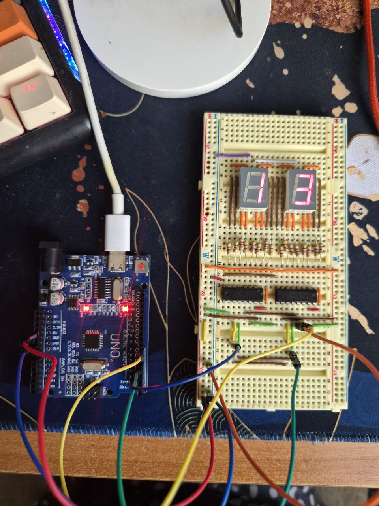
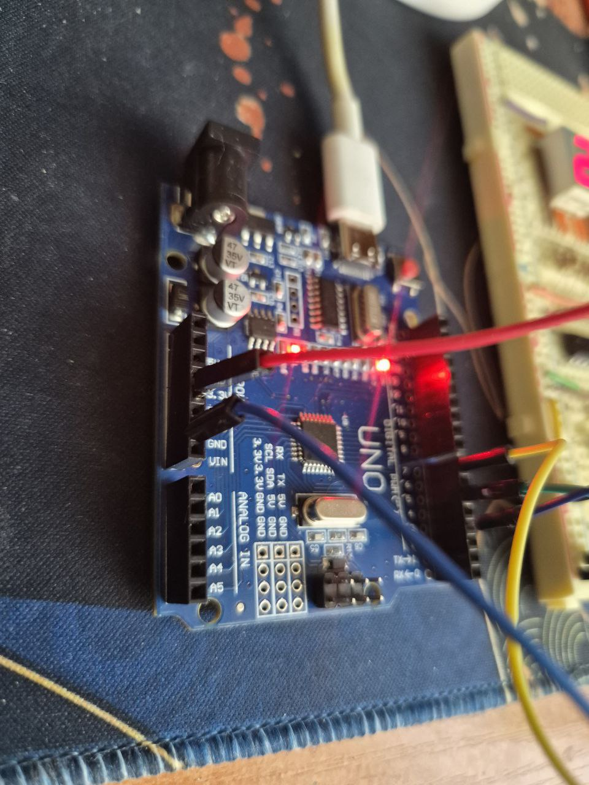

### Задача: 

Создать систему управления двумя семисегментными индикаторами через каскадное соединение сдвиговых регистров, способную отображать двузначный секундомер.
Система должна получать начальное значение времени через последовательный порт (Serial) и автоматически управлять регистрами (сдвиг битов и вывод данных) с помощью таймеров.

### Требования:
- Неблокирующая работа — не использовать функцию delay(), все временные интервалы реализуются через аппаратные таймеры
- Обновление по таймеру — обновление индикации и счетчика выполняется в ISR (для линий Clock и Latch)
- Инициализация через Serial — счетчик принимает начальное значение (00–99) через Serial Monitor
- Точная синхронизация — инкремент счетчика каждые 1 секунду с минимальным дрейфом, дополнительные операции не должны влиять на точность
- Эффективность использования пинов — минимальное количество пинов Arduino для управления двумя индикаторами
- Портируемость кода — код должен одинаково работать в Tinkercad и на реальном оборудовании
- Синхронизация данных — безопасный обмен между главным циклом и ISR через глобальные volatile переменные
- Поддержка общего анода и катода — в прошивке должен быть флаг, определяющий тип индикатора; не допускается изменение других переменных
- Не использовать digitalWrite(), shiftOut(), delay() 




Tinkercad: [https://www.tinkercad.com/things/hnNtEVHBlZ5-copy-of-cascadingregisters/editel?returnTo=https%3A%2F%2Fwww.tinkercad.com%2Fdashboard%2Fdesigns%2Fcircuits&sharecode=BYPCYIanupUvLSnWW86BliIWL2g6GKJZl2-BDIHl_fA](https://www.tinkercad.com/things/hnNtEVHBlZ5-copy-of-cascadingregisters/editel?returnTo=https%3A%2F%2Fwww.tinkercad.com%2Fdashboard%2Fdesigns%2Fcircuits&sharecode=BYPCYIanupUvLSnWW86BliIWL2g6GKJZl2-BDIHl_fA)
### Рассмотрим код и логику его работы.

##### Глобальные константы и настройки
```c++
#include <avr/io.h>
#include <avr/interrupt.h>
const bool IS_COMMON_ANODE = false; 


volatile uint8_t counter = 0; // Счетчик от 00 до 99
volatile bool updateDisplay = true; // Флаг необходимости обновления

const uint8_t digitMap[10] = {
  0b10111011, 
  0b00001010, 
  0b01110011, 
  0b01011011, 
  0b11001010,  
  0b11011001, 
  0b11111001, 
  0b00001011, 
  0b11111011, 
  0b11011011  
};


//  для прямого управления портами
#define DATA_PIN  7
#define LATCH_PIN 5
#define CLOCK_PIN 3

#define DATA_HIGH  (PORTD |= (1 << DATA_PIN))
#define DATA_LOW   (PORTD &= ~(1 << DATA_PIN))
#define LATCH_HIGH (PORTD |= (1 << LATCH_PIN))
#define LATCH_LOW  (PORTD &= ~(1 << LATCH_PIN))
#define CLOCK_HIGH (PORTD |= (1 << CLOCK_PIN))
#define CLOCK_LOW  (PORTD &= ~(1 << CLOCK_PIN))
```
- IS_COMMON_ANODE — флаг конфигурации типа индикатора (если true — инвертирует биты при выводе)
- counter — основная переменная счетчика, хранящая текущее значение 
- digitMap — массив кодировки цифр для 7-сегментного индикатора
- DATA/LATCH/CLOCK — заменяют функцию digitalWrite(), изменяя состояние битов в регистре PORTD напрямую

##### Вспомогательные функции

##### 1. Программный сдвиг байта (Bit-banging)
```c++
inline void shiftOutByte(uint8_t data) {
  for (uint8_t i = 0; i < 8; i++) {
    if (data & 0x80) {
      DATA_HIGH;
    } else {
      DATA_LOW;
    }
    
    // Импульс тактирования
    CLOCK_HIGH;
    CLOCK_LOW;
    
    data <<= 1; // Сдвиг влево
  }
}
```
- реализует передачу данных в сдвиговый регистр 
- использует макросы прямого доступа к портам для высокой скорости
- данные передаются старшим битом вперед

##### 2. Обновление регистров
```c++
void updateShiftRegisters(uint8_t num) {
  uint8_t tens = num / 10;
  uint8_t ones = num % 10;
  
  uint8_t segTens = digitMap[tens];
  uint8_t segOnes = digitMap[ones];

  if (IS_COMMON_ANODE) {
    segTens = ~segTens;
    segOnes = ~segOnes;
  }
  
  LATCH_LOW;  
  shiftOutByte(segTens); 
  shiftOutByte(segOnes);
  LATCH_HIGH;
}
```
- разбивает число на десятки и единицы
- получает битовую маску из `digitMap` и инвертирует её при необходимости (для общего анода)
- управляет линией защелки и последовательно отправляет два байта в каскад регистров

##### 3. Принудительное обновление
```c++
void forceUpdate() {
  cli();
  updateShiftRegisters(counter);
  sei();
}
```
- обертка для безопасного обновления дисплея из основного цикла
- отключает прерывания (`cli`) на момент чтения/записи общих ресурсов

### setup()
```c++
void setup() {
  // Настройка пинов через регистр DDRD
  DDRD |= (1 << DATA_PIN) | (1 << LATCH_PIN) | (1 << CLOCK_PIN);
  PORTD &= ~((1 << DATA_PIN) | (1 << LATCH_PIN) | (1 << CLOCK_PIN));

  Serial.begin(9600);

  cli(); 
  
  // Настройка Timer1 (16-бит)
  TCCR1A = 0;
  TCCR1B = 0;
  TCNT1  = 0;

  // Расчет регистра совпадения для 1 Гц
  // (16 МГц / 1024) - 1 = 15624
  OCR1A = 15624;

  TCCR1B |= (1 << WGM12); // Режим CTC
  TCCR1B |= (1 << CS12) | (1 << CS10); // Предделитель 1024
  TIMSK1 |= (1 << OCIE1A); // Разрешение прерывания

  sei(); 
  forceUpdate(); 
}
```
- переводит пины в режим выхода, манипулируя регистром DDRD
- настраивает 16-битный Таймер 1 в режим CTC 
- устанавливает частоту прерываний ровно 1 Гц для точного отсчета времени без дрейфа

### loop()
```c++
void loop() {
  if (Serial.available() > 0) {
    int val = Serial.parseInt();
    while (Serial.available() > 0) Serial.read();

    if (val >= 0 && val <= 99) {
      cli(); 
      counter = (uint8_t)val;
      sei();
      forceUpdate();
    }
  }
}
```
- обрабатывает входящие данные из Serial Monitor
- позволяет установить начальное значение счетчика (0-99)
- использует атомарный блок (`cli`/`sei`) при записи в `counter` для предотвращения конфликтов с прерыванием

### Обработчики прерываний

##### ISR(TIMER1_COMPA_vect)
```c++
ISR(TIMER1_COMPA_vect) {
  counter++;
  if (counter > 99) {
    counter = 0;
  }
  updateShiftRegisters(counter);
}
```
- вызывается аппаратно ровно 1 раз в секунду
- инкрементирует счетчик и сбрасывает его при переполнении (>99)
- сразу обновляет индикацию на дисплее, обеспечивая синхронность смены цифр с системным временем