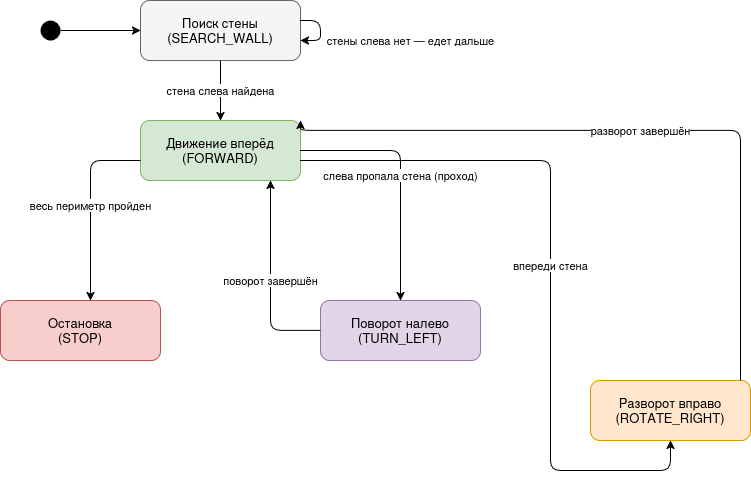

### Задача:

Разработать машину состояний для задачи следования по периметру в лабиринте. Реализовать обход периметра в лабиринте. Параметры лабиринта:


- можно обойти держась левой (или правой) рукой за стену и делая поворот в нужных местах, т.е. такой в которм нет отдельно стоящих стен.
- ширина (D) всех коридоров, позволяет вместить машинку (R радиус машинки) и внутри коридора (от CD до FD), т.е. D >= FD
- повороты только 90 (и 270) градусов.
### Требования:

- машинки не должна сталкиваться со стенками, для удержание в коридоре можно использовать PID контроллер который позволяет плавно
- корректировать движения с учетом показаний датчков. Примеры PID для движение по линии и вдоль стены.
- скорость обхода не влияет на оценку.
- пропуск коридора считается за ошибку.
- допустимо движение назад если, если это предусматривает алгоритм поиска стены или прохода в стене.


### Таблица состояний:



| Состояние | Условие перехода | Следующее состояние | Действие |
|---|---|---|---|
| `SEARCH_WALL` | стены слева ещё нет (`ld > FD`) | `SEARCH_WALL` | едет вперёд, ищет левую стену |
| `SEARCH_WALL` | стена слева найдена (`ld <= FD`) | `FORWARD` | начинает обход периметра |
| `FORWARD` | слева пропала стена (`ld > FD`) | `TURN_LEFT` | проезд на длину `CD`, затем поворот налево на 90° |
| `FORWARD` | впереди стена (`fd < CD`) | `ROTATE_RIGHT` | разворот вправо на месте на 90° |
| `FORWARD` | прочие условия | `FORWARD` | движение вперёд с PID-коррекцией по `ld` |
| `TURN_LEFT` | таймер поворота 90° истёк | `FORWARD` | поворот завершён |
| `ROTATE_RIGHT` | таймер разворота 90° истёк | `FORWARD` | разворот завершён |
| любое | весь периметр пройден | `STOP` | остановка моторов |

### Рассмотрим код и логику его работы.

##### 1. Пины моторов и направления

```cpp
#define SPEED_LEFT   5
#define SPEED_RIGHT  6
#define DIR_LEFT     4
#define DIR_RIGHT    7

#define FORWARD_LEFT   LOW
#define BACKWARD_LEFT  HIGH
#define FORWARD_RIGHT  LOW
#define BACKWARD_RIGHT HIGH
```

- `SPEED_LEFT` и `SPEED_RIGHT` — ШИМ-пины скорости левого и правого моторов.
- `DIR_LEFT` и `DIR_RIGHT` — пины направления вращения каждого мотора.
- Макросы `FORWARD_*` и `BACKWARD_*` задают логические уровни направления, чтобы в коде использовать понятные имена вместо `LOW`/`HIGH`.

##### 2. Пины датчиков расстояния

```cpp
#define TRIG_FRONT  8
#define ECHO_FRONT  9
#define TRIG_LEFT   10
#define ECHO_LEFT   11
```

- Передний датчик подключён к пинам `TRIG_FRONT` и `ECHO_FRONT`, левый — к `TRIG_LEFT` и `ECHO_LEFT`.
- Передний датчик определяет стену впереди, левый — расстояние до левой стены, вдоль которой идёт обход.

##### 3. Параметры лабиринта и движения

```cpp
const float CD = 15.0;
const float FD = 300.0;
const int   BASE_SPEED   = 150;
const int   ROTATE_SPEED = 150;

const unsigned long TURN_90_MS = 1250;
const unsigned long CD_MS      = 500;
```

- `CD` — целевое расстояние до боковой стены в сантиметрах; одновременно служит порогом «впереди стена».
- `FD` — порог, при превышении которого считается, что стены или прохода рядом нет.
- `BASE_SPEED` — базовая скорость движения вперёд, `ROTATE_SPEED` — скорость разворота на месте.
- `TURN_90_MS` — длительность поворота на 90°, `CD_MS` — длительность проезда на длину `CD` перед поворотом налево. Тайминги подбираются экспериментально под конкретную машинку.

##### 4. Параметры PID-регулятора

```cpp
float Kp = 6.0;
float Ki = 0.0;
float Kd = 3.0;
float pid_integral = 0;
float pid_prev_err = 0;
```

- `Kp`, `Ki`, `Kd` — коэффициенты пропорциональной, интегральной и дифференциальной составляющих регулятора.
- `pid_integral` — накопленная сумма ошибки, `pid_prev_err` — ошибка на предыдущем шаге, нужна для дифференциальной составляющей.
- PID удерживает машинку на расстоянии `CD` от левой стены, плавно корректируя движение по показаниям бокового датчика.

##### 5. Перечисление состояний

```cpp
enum State { SEARCH_WALL, FORWARD, TURN_LEFT, ROTATE_RIGHT, STOP };
State state = SEARCH_WALL;

unsigned long state_timer = 0;
```

- `enum State` перечисляет все состояния машины состояний; они соответствуют узлам схемы в `IOT.png`.
- Переменная `state` хранит текущее состояние, начальное значение — `SEARCH_WALL`.
- `state_timer` фиксирует момент входа в состояния с таймером (повороты), чтобы отслеживать их длительность без блокирующих задержек.

##### 6. Управление моторами

```cpp
void move(bool left_dir, int left_speed, bool right_dir, int right_speed) {
  left_speed  = constrain(left_speed, 0, 255);
  right_speed = constrain(right_speed, 0, 255);
  digitalWrite(DIR_LEFT,  left_dir);
  digitalWrite(DIR_RIGHT, right_dir);
  analogWrite(SPEED_LEFT,  left_speed);
  analogWrite(SPEED_RIGHT, right_speed);
}

void forward(int speed) {
  move(FORWARD_LEFT, speed, FORWARD_RIGHT, speed);
}

void backward(int speed) {
  move(BACKWARD_LEFT, speed, BACKWARD_RIGHT, speed);
}

void forward_corrected(int speed, int correction) {
  int left  = speed + correction;
  int right = speed - correction;
  move(FORWARD_LEFT, left, FORWARD_RIGHT, right);
}

void rotate_left(int speed) {
  move(BACKWARD_LEFT, speed, FORWARD_RIGHT, speed);
}

void rotate_right(int speed) {
  move(FORWARD_LEFT, speed, BACKWARD_RIGHT, speed);
}

void stop_motors() {
  move(FORWARD_LEFT, 0, FORWARD_RIGHT, 0);
}
```

- `move()` — базовая функция: задаёт направление и скорость обоих моторов, ограничивая скорость диапазоном `0–255`.
- `forward()` и `backward()` — движение прямо вперёд и назад с равной скоростью моторов.
- `forward_corrected()` — движение вперёд с поправкой от PID: один мотор ускоряется, другой замедляется, что доворачивает машинку к нужной дистанции до стены.
- `rotate_left()` и `rotate_right()` — разворот на месте: моторы вращаются в противоположные стороны.
- `stop_motors()` — полная остановка моторов.

##### 7. Чтение датчиков расстояния

```cpp
float readDistance(int trigPin, int echoPin) {
  digitalWrite(trigPin, LOW);
  delayMicroseconds(2);
  digitalWrite(trigPin, HIGH);
  delayMicroseconds(10);
  digitalWrite(trigPin, LOW);

  long duration = pulseIn(echoPin, HIGH, 25000);
  if (duration == 0) return FD;
  return duration * 0.0343 / 2.0;
}
```

- Функция подаёт короткий импульс на `trigPin` и измеряет длительность ответного импульса на `echoPin`.
- Длительность пересчитывается в расстояние в сантиметрах через скорость звука (`0.0343` см/мкс), деление на 2 учитывает путь сигнала туда и обратно.
- При отсутствии эха (`duration == 0`) возвращается `FD` — расстояние считается большим, «свободно».

##### 8. Расчёт PID-коррекции

```cpp
int computePID(float ld) {
  float error = ld - CD;
  pid_integral += error;
  pid_integral = constrain(pid_integral, -50, 50);
  float derivative = error - pid_prev_err;
  pid_prev_err = error;

  float output = Kp * error + Ki * pid_integral + Kd * derivative;
  int correction = (int)(-output);
  return constrain(correction, -BASE_SPEED, BASE_SPEED);
}
```

- `error` — отклонение текущего расстояния до левой стены от целевого `CD`.
- Интегральная составляющая накапливается и ограничивается диапазоном `-50…50` для защиты от перенакопления.
- Дифференциальная составляющая вычисляется как разность текущей и предыдущей ошибки.
- Итоговая поправка `correction` ограничивается по модулю `BASE_SPEED` и передаётся в `forward_corrected()`.

#### setup()

```cpp
void setup() {
  Serial.begin(9600);

  pinMode(SPEED_LEFT, OUTPUT);
  pinMode(SPEED_RIGHT, OUTPUT);
  pinMode(DIR_LEFT, OUTPUT);
  pinMode(DIR_RIGHT, OUTPUT);

  pinMode(TRIG_FRONT, OUTPUT);
  pinMode(ECHO_FRONT, INPUT);
  pinMode(TRIG_LEFT, OUTPUT);
  pinMode(ECHO_LEFT, INPUT);

  stop_motors();
  delay(1000);
}
```

- Инициализируется последовательный порт для вывода отладочной информации.
- Пины моторов настраиваются как выходы.
- Пины `TRIG` датчиков настраиваются как выходы, пины `ECHO` — как входы.
- Моторы останавливаются, после чего выдерживается пауза в одну секунду перед стартом обхода.

#### loop()

```cpp
void loop() {
  float fd = readDistance(TRIG_FRONT, ECHO_FRONT);
  float ld = readDistance(TRIG_LEFT,  ECHO_LEFT);

  switch (state) {

    case SEARCH_WALL:
      forward(BASE_SPEED);
      if (ld <= FD) {
        state = FORWARD;
        pid_integral = 0;
        pid_prev_err = 0;
      }
      break;

    case FORWARD:
      if (ld > FD) {
        state_timer = millis();
        state = TURN_LEFT;
      } else if (fd < CD) {
        state_timer = millis();
        state = ROTATE_RIGHT;
      } else {
        int correction = computePID(ld);
        forward_corrected(BASE_SPEED, correction);
      }
      break;

    case TURN_LEFT:
      if (millis() - state_timer < CD_MS) {
        forward(BASE_SPEED);
      } else if (millis() - state_timer < CD_MS + TURN_90_MS) {
        rotate_left(ROTATE_SPEED);
      } else {
        state = FORWARD;
        pid_integral = 0;
        pid_prev_err = 0;
      }
      break;

    case ROTATE_RIGHT:
      if (millis() - state_timer < TURN_90_MS) {
        rotate_right(ROTATE_SPEED);
      } else {
        state = FORWARD;
        pid_integral = 0;
        pid_prev_err = 0;
      }
      break;

    case STOP:
      stop_motors();
      break;
  }

  delay(30);
}
```

- В начале каждой итерации считываются показания переднего (`fd`) и левого (`ld`) датчиков.
- Конструкция `switch (state)` реализует машину состояний — поведение машинки полностью определяется текущим состоянием.
- `SEARCH_WALL` — машинка едет вперёд, пока не обнаружит левую стену; при обнаружении переходит в `FORWARD`.
- `FORWARD` — основное состояние обхода: если слева пропала стена, выполняется переход в `TURN_LEFT`; если впереди стена — в `ROTATE_RIGHT`; иначе движение продолжается с PID-коррекцией дистанции до стены.
- `TURN_LEFT` — машинка сначала проезжает вперёд на длину `CD`, чтобы войти в проход, затем поворачивает налево на 90°; по завершении возвращается в `FORWARD`.
- `ROTATE_RIGHT` — машинка разворачивается вправо на месте на 90° и возвращается в `FORWARD`.
- `STOP` — моторы остановлены, обход завершён.
- При каждом переходе в `FORWARD` сбрасываются накопленные значения PID, чтобы регулятор стартовал без накопленной ошибки.
- Тайминги поворотов отслеживаются через `millis()`, что не блокирует выполнение цикла.
- Завершающий `delay(30)` задаёт период опроса датчиков.